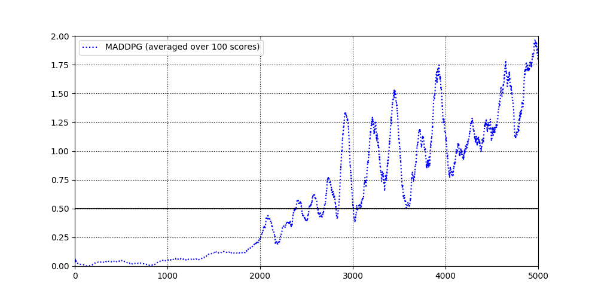

# Collaboration-and-Competition

Deep Reinforcement Learning Nanodegree Project 3 report (Multiagent RL)

### Project description

In this environment called Tennis, two agents control rackets to bounce a ball over a net. If an agent hits the ball over the net, it receives a reward of +0.1. If an agent lets a ball hit the ground or hits the ball out of bounds, it receives a reward of -0.01. Thus, the goal of each agent is to keep the ball in play. Additional information can be found here: [link]()

The observation space of an agent consists of 8 variables. Each action is a 2D vector with entries corresponding to movement toward (or away from) the net, and jumping.

- **State space** is a `2x24` dimensional continuous tensor, consisting of positions, and velocities of each agent across 3 frames.

- **Action space** is `2x2` dimentional continuous tensor, corresponding actions for each agent. Every entry in the action tensor should be a number between -1 and 1.

- **Solution criteria**: the task is episodic, and in order to solve the environment, your agents must get an average score of **+0.5 over 100 consecutive episodes, after taking the maximum over both agents**.

### Getting started

#### Configuration

PC configuration used for this project:
- OS: Mac OS 10.14 Mojave
- i7-8800H, 32GB, Radeon Pro 560X 4GB

#### Structure

All project files are stored in `/src` folder:
- `main.py` - main file where the program execution starts.
- `agent.py` - agent class implementation.
- `unity_env.py` - Unity Environment wrapper (borrowed from [here](https://github.com/Unity-Technologies/ml-agents/blob/master/gym-unity/gym_unity/envs/unity_env.py) and modified).
- `trainer.py` - trainer (interface between agent and environment) implementation.
- `replay_buffer.py` - memory replay buffer implementation.
- `models.py` - neural network implementations (PyTorch)
- `uo_process.py` - Ornstein–Uhlenbeck process class implementation.

All project settings are stored in JSON file: `settings.json`. It is divided into 4 sections: 
- `general_params` - general, module agnostic parameters: mode (`train` or `test`), number of episodes, seed.
- `agent_params` - agent parameters: epsilon, gamma, learning rate, etc. This section also includes neural network configuration settings and memory replay buffer parameters.
- `trainer_params` - trainer parameters depending on the algorithm. They are responsible for any change of agent learning parameters. Agent can't change them.
- `env_params` - environment parameters: path, number of agents, etc.

#### Environment setup

- For detailed Python environment setup (PyTorch, the ML-Agents toolkit, and a few more Python packages) please follow these steps: [link](https://github.com/udacity/deep-reinforcement-learning#dependencies)

- Download pre-built Unity Environment:
  - [Linux](https://s3-us-west-1.amazonaws.com/udacity-drlnd/P3/Tennis/Tennis_Linux.zip)
  - [Mac](https://s3-us-west-1.amazonaws.com/udacity-drlnd/P3/Tennis/Tennis.app.zip)
  - [Win x32](https://s3-us-west-1.amazonaws.com/udacity-drlnd/P3/Tennis/Tennis_Windows_x86.zip)
  - [Win x64](https://s3-us-west-1.amazonaws.com/udacity-drlnd/P3/Tennis/Tennis_Windows_x86_64.zip)

 - Open `settings.json` and specify the relative path to the application file in `"path"` inside of `"env_params"`.

### Implementation details

#### MADDPG

Paper: [Multi-Agent Actor-Critic for Mixed Cooperative-Competitive Environments](https://arxiv.org/abs/1706.02275)

MADDPG is summarised below: 

**Idea (Summary)**. 

- Critic. Use single neural network with two "heads" for Q-value function approximation as `state1, state2, action1, action2` -> `q_value1, q_value2`, where `state1, state2, action1, action2` are the states and actions of agents 1 and 2 correspondingly.
- Actor. Use two neural networks for determenistic policy approximation as `state_i` -> `argmax_Q_i` mapping for each agent separately.
- Add a sample of the Ornstein–Uhlenbeck process ([link](https://en.wikipedia.org/wiki/Ornstein%E2%80%93Uhlenbeck_process)) for exploration.

Neural network architecture for actor (both actors use the same architecture):

| Layer   | (in, out)          | Activation|
|---------|--------------------|-----------|
| Layer 1 | (`state_size`, 128) | `relu`|
| Layer 2 | (128, 64) | `relu` |
| Layer 3 | (64, `action_size`)| `tanh` |

Neural network architecture for critic:

| Layer   | (in, out)          | Activation|
|---------|--------------------|-----------|
| Layer 1 | (`(state_size + action_size) * num_agents`, 256) | `relu`|
| Layer 2 | (256, 128) | `relu` |
| Layer 3_1 | (128, 64)| `relu` |
| Layer 4_1 | (64, 1) | - |
| Layer 3_2 | (128, 64)| `relu` |
| Layer 4_2 | (64, 1) | - |

The main idea of MADDPG is to use a single critic, that outputs Q values for each agent during training, while actors can be local and trained separately. The following diagram illustrates this:

MADDPG implementation can be found in `agent.py` under `__update(...)` method.

Main hyperparameters:
- `learning_rate_actor`: 0.001,
- `learning_rate_critic`: 0.001, 
- `gamma`: 0.99,
- `tau`: 0.01, 
- `buffer_size`: 100000,
- `batch_size`: 256,
- `learning_rate_decay`: 0.999

### Results

- The following graph shows avegrage reward the 10000 episodes of training. As can be seen, the average reward remains much higher than required +0.5, sometimes reaching values above +1.5. 

- Log files of the training procedure can be found in `logs/` folder.
- Actor and critic checkpoints are saved in `results/` folder.

### Possible improvements

- One of the possible algortihm improvements is to use PPO algorithms with actors outputting mean and standard deviations of actions the agents take. The details of PPO are described in the previous project on continuous control: https://github.com/SIakovlev/Continuous-Control#ppo 
- Fully decentralised approach based on: [paper_link](https://arxiv.org/abs/1802.08757)
